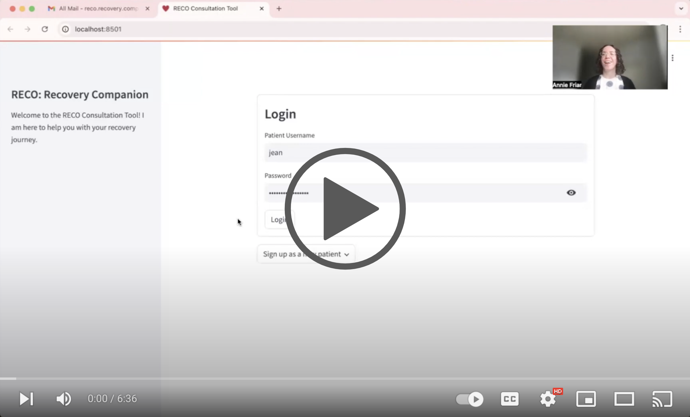

# RECO: Recovery Companion

We developed a conversational AI that assists patients with heart failure (HF) who have recently been discharged from the hospital. HF is a condition where the heart struggles to pump blood efficiently, often due to damage or disease affecting the heart's muscle. Patients frequently face worsened symptoms soon after hospital discharge, which if not addressed swiftly, can lead to rehospitalization.

RECO aims to monitor these patients by routinely asking about their symptoms, vital signs, and medication adherence. It will then compile this information into a structured report for their physician. This proactive approach helps in detecting any worsening of the condition early, potentially prompting timely medical interventions. The conversational AI is not designed to diagnose conditions or offer medical advice directly to patients but serves as a crucial communication bridge between patients and their healthcare providers.

## Reco Demo

    

## Features

- **Symptom Tracking:** Monitors patient-reported symptoms and vitals through clinically informed daily interactions.
- **Summarized Report:** Accurate summary of patient encounter is automatically sent to the patient's provider for review.

## Technical Architecture

    

RECO is built using the following technologies:

- **Frontend:** Streamlit for interactive web interface.
- **Backend:** Python, Flask for API management, and handling server-side logic.
- **AI Model:** Utilizes OpenAI's GPT models for natural language understanding and generation.
- **Database:** PostgreSQL for storing patient data securely.

## Request for a Live Demo

If you would like a live demo, please reach out to <reco.recovery.companion@gmail.com>.

## Team

RECO is a capstone project developed by a team of us at the University of California, Berkeley as part of our Master of Information and Data Science program.

<table>
  <tr>
    <td></td>
    <td></td>
    <td></td>
    <td></td>
  </tr>
  <tr>
    <td>
<a href="mailto:mike.khor@berkeley.edu">Mike Khor</a>
</td>
    <td>
<a href="mailto:garykong@berkeley.edu">Gary Kong</a>
</td>
    <td>
<a href="mailto:anniefriar@berkeley.edu">Annie Friar</a>
</td>
    <td>
<a href="mailto:farid.gholitabar@berkeley.edu">Dr. Farid Gholitabar</a>
</td>
  </tr>
 </table>

## Acknowledgements

We would like to thank our course instructors (Professors Joyce Schen, Zona Kostic), the UC Berkeley I School, and all those who provided invaluable feedback and support throughout the project.

## Contributions

Contributions are welcome! Feel free to fork the project and submit a pull request. For major changes, please open an issue first to discuss what you would like to change.

Please make sure to update tests as appropriate.
