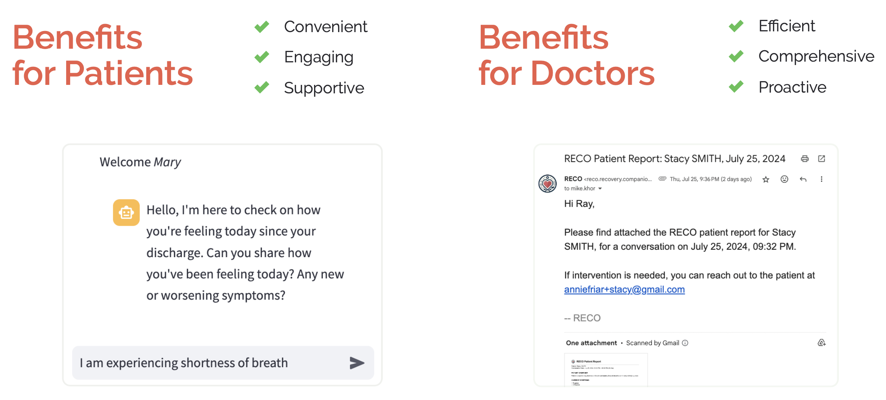

# RECO: Recovery Companion

## Why Heart Failure?
Heart failure affects 1 in 33 Americans. Patients often experience worsening symptoms soon after hospital discharge, which can lead to rehospitalization. Nearly 25% of heart failure patients are readmitted within 30 days of discharge, costing the healthcare system billions annually. Resource constraints and the limitations of form-based post-discharge monitoring often result in reactive rather than proactive care, leading to avoidable hospital readmissions.

## Product Overview
RECO: Recovery Companion is designed reduces hospital readmissions by providing continuous, AI-driven monitoring and support for heart failure patients after discharge. The platform gathers clinically relevant data—such as symptoms, vital signs, and medication adherence—and compiles this information into structured reports for physicians. This proactive approach ensures better continuity of care and enables timely interventions.

    

## System Architecture
RECO’s architecture seamlessly integrates a user interface, chatbot, database, and summarization engine to provide an end-to-end solution for patient monitoring.

    

## Modeling Approach
The development of the RECO system incorporates a GPT-4 powered chatbot, simulated conversations with synthetic patients, a summarization engine, and a combination of human and *LLM-as-a-judge* evaluation.

    

### Chatbot
The RECO system includes a chatbot designed to simulate a doctor’s role in collecting patient information. Using a system prompt, the RECO chatbot uses GPT-4o to guide conversations, asking questions and gathering data just as a doctor would during a routine appointment. The system prompt ensures that the chatbot covers all necessary aspects of a patient’s condition, including symptoms, vitals, and medication adherence.

### Synthetic Patients & Conversation Simulation
To test the effectiveness of the chatbot, we simulate chatbot-patient conversations using a synthetic patient bot which interacts with the RECO chatbot. The synthetic patient bot is modeled using anonymized real-world data from MIMIC-IV and can take on various personas, including a cooperative patient who readily provides information and a reluctant patient who hesitates or withholds details. These simulations generate transcripts that reflect actual patient scenarios, providing valuable data to evaluate the chatbot’s ability to navigate different patient behaviors and effectively collect necessary information.

### Summarization Engine
The RECO system includes a summarization engine that processes patient-doctor interaction transcripts to produce concise, clinically relevant summaries. After the patient and chatbot complete their conversation, the conversation transcript is analyzed by the summarization engine, which uses a system prompt fed into GPT-4o-mini. This engine identifies key details related to symptoms, vitals, and medication adherence, distilling them into structured summaries that highlight the most relevant information for physicians. These summaries are then formatted into PDF reports which are emailed to physicians.

### Chatbot & Summarization Engine Evaluation
Evaluation criteria were developed based on insights from domain experts, focusing on the chatbot’s ability to gather relevant patient data and exhibit empathy, as well as summarization accuracy. These criteria were applied in manual human evaluation of RECO-generated transcripts and summaries. We also created an *LLM-as-a-judge* system to automatically assess the transcripts and summaries against the evaluation criteria. This system was iterated upon and validated against human evaluation results, ensuring it matched human judgment on most evaluation criteria. With a validated *LLM-as-a-judge* system in place, we were able to make scalable, iterative improvements to the RECO system.

    

## See RECO in Action
View our product demo by clicking the thumbnail below.

    

If you would like a live demo, please reach out to <reco.recovery.companion@gmail.com>.

## Key Project Impact
RECO addresses key challenges in post-discharge heart failure management by providing:
- **Enhanced Decision-Making:** Doctors receive concise summaries, facilitating quicker and better-informed clinical decisions.
- **Scalability:** The system allows for the management of larger patient volumes without overburdening healthcare providers.
- **Patient Engagement:** Studies show and patients agree: the chatbot is easier and more straightforward than traditional forms.

## Learn More
View the detailed presentation on [SlideShare](https://www.slideshare.net/secret/FWIu2e4jjTyvmL).

## Team
RECO is a capstone project developed by a team of us at the University of California, Berkeley as part of our Master of Information and Data Science program.

<table>
  <tr>
    <td></td>
    <td></td>
    <td></td>
    <td></td>
  </tr>
  <tr>
    <td>
<a href="mailto:mike.khor@berkeley.edu">Mike Khor</a>
</td>
    <td>
<a href="mailto:garykong@berkeley.edu">Gary Kong</a>
</td>
    <td>
<a href="mailto:anniefriar@berkeley.edu">Annie Friar</a>
</td>
    <td>
<a href="mailto:farid.gholitabar@berkeley.edu">Dr. Farid Gholitabar</a>
</td>
  </tr>
 </table>

## Acknowledgements
We would like to thank our course instructors (Professors Joyce Shen, Zona Kostic), the UC Berkeley I School, and all those who provided invaluable feedback and support throughout the project.

## Contributions
Contributions are welcome! Feel free to fork the project and submit a pull request. For major changes, please open an issue first to discuss your ideas.

Ensure that appropriate tests are updated when making changes.

    

