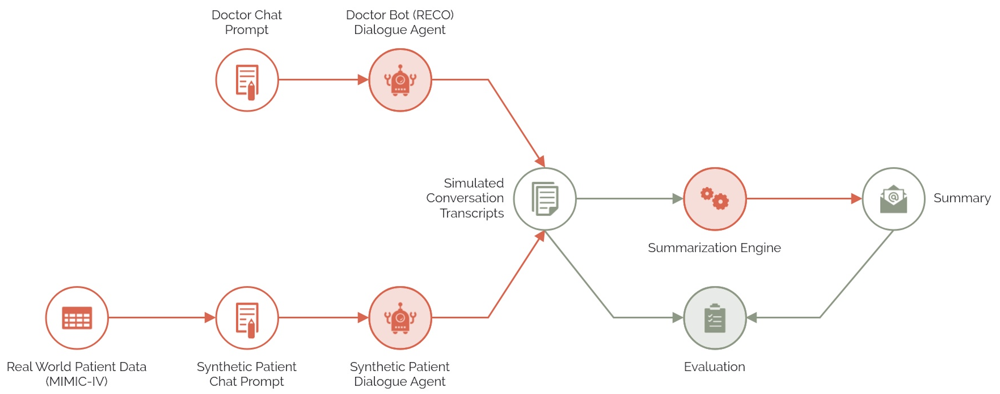

# RECO: Recovery Companion

## Why Heart Failure?
1 in 33 Americans suffer from heart failure. Patients who are hospitalized frequently face worsened symptoms soon after discharge which, if not addressed swiftly, can lead to rehospitalization. Approximately 25% of heart failure patients are readmitted within 30 days of discharge, costing the healthcare system billions annually.

## Product Overview
RECO aims to reduce readmission rates by providing continuous, AI-driven monitoring and support for heart failure patients. It collects clinically relevant symptoms information, and then compiles this information into a structured report for their physician.

    

## Architecture
RECO’s architecture seamlessly integrates a user interface, chatbot, database, and summarization engine to provide an end-to-end solution for patient monitoring.

    

### Chatbot
The RECO chatbot is designed to simulate a doctor’s role in collecting patient information. Using a system prompt, the chatbot uses GPT-4o to guide conversations, asking questions and gathering data just as a doctor would during a routine appointment.

### Summarizer
The RECO summarization engine analyzes the conversation transcript using a system prompt with GPT-4o-mini, extracting key details like symptoms, vitals, and medications. It then distills this information into structured summaries that are formatted and emailed as PDF reports to physicians.

## Modeling Approach
Development of the RECO system involved simulating conversations with synthetic patients, and establishing an automated evaluation system to enable iterative improvements.

    

### Conversation Simulation
We simulated chatbot-patient conversations by having the RECO chatbot interact with synthetic patient bots. Synthetic patient bots are modeled using anonymized real-world patient data from MIMIC-IV. We created synthetic patients that can take on various personas, including a cooperative patient who readily provides information and a reluctant patient who withholds details. These simulated conversations generate transcripts that are used both for evaluation and as input for the summarizer.

### Evaluation
We developed an LLM-as-a-judge system to automatically assess the transcripts and summaries against evaluation criteria that focused on the system’s ability to gather relevant patient data, maintain clinical quality, and ensure summarization accuracy. To ensure the reliability of LLM-as-a-judge, we compared its outputs to the ground truth of human judgment and iteratively refined the system to enhance its accuracy.

    

### Iterative Improvement
Using the automated evaluation pipeline, we tested and modified RECO’s underlying models (e.g., GPT-3.5-turbo vs. GPT-4o-mini vs. GPT-4o) and adjusted prompts to improve conversation quality, such as nudging reluctant patients to provide more information.

## See RECO in Action
View our product demo by clicking the thumbnail below.

    

If you would like a live demo, please reach out to <reco.recovery.companion@gmail.com>.

## Project Impact
RECO addresses key challenges in post-discharge heart failure management by providing:
- **Improved Data Accuracy:** The summarization engine minimizes human error and provides consistent, relevant information for healthcare providers.
- **Enhanced Decision-Making:** Doctors receive concise summaries, facilitating quicker and better-informed clinical decisions.
- **Scalability:** The system allows for the management of larger patient volumes without overburdening healthcare providers.
- **Patient Engagement:** Studies and patient feedback indicate that the chatbot is easier and more straightforward than traditional forms.

## Learn More
View the detailed presentation on [SlideShare](https://www.slideshare.net/secret/FWIu2e4jjTyvmL).

## Team
RECO is a capstone project developed by a team of us at the University of California, Berkeley as part of our Master of Information and Data Science program.

<table>
  <tr>
    <td></td>
    <td></td>
    <td></td>
    <td></td>
  </tr>
  <tr>
    <td style="text-align: center;"><a href="mailto:mike.khor@berkeley.edu">Mike Khor</a></td>
    <td style="text-align: center;"><a href="mailto:garykong@berkeley.edu">Gary Kong</a></td>
    <td style="text-align: center;"><a href="mailto:anniefriar@berkeley.edu">Annie Friar</a></td>
    <td style="text-align: center;"><a href="mailto:farid.gholitabar@berkeley.edu">Dr. Farid Gholitabar</a></td>
  </tr>
</table>

## Acknowledgements
We would like to thank our course instructors (Professors Joyce Shen, Zona Kostic), the UC Berkeley I School, and all those who provided invaluable feedback and support throughout the project.

## Contributions
Contributions are welcome! Feel free to fork the project and submit a pull request. For major changes, please open an issue first to discuss your ideas.

Ensure that appropriate tests are updated when making changes.

    

