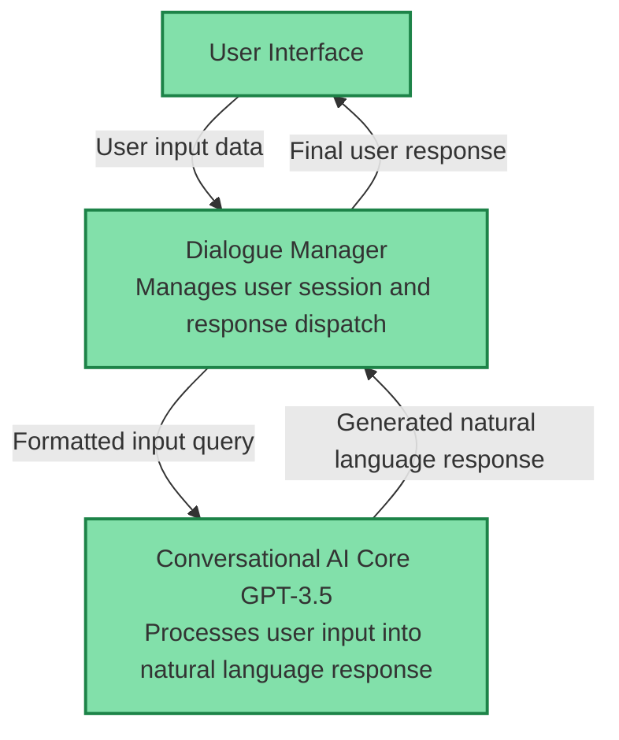
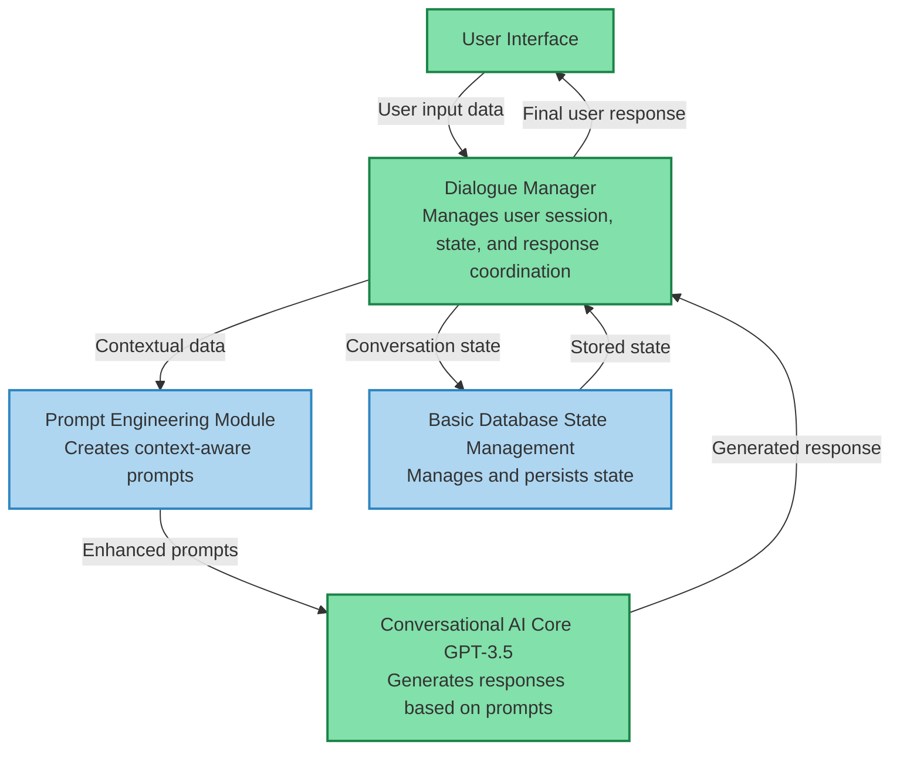
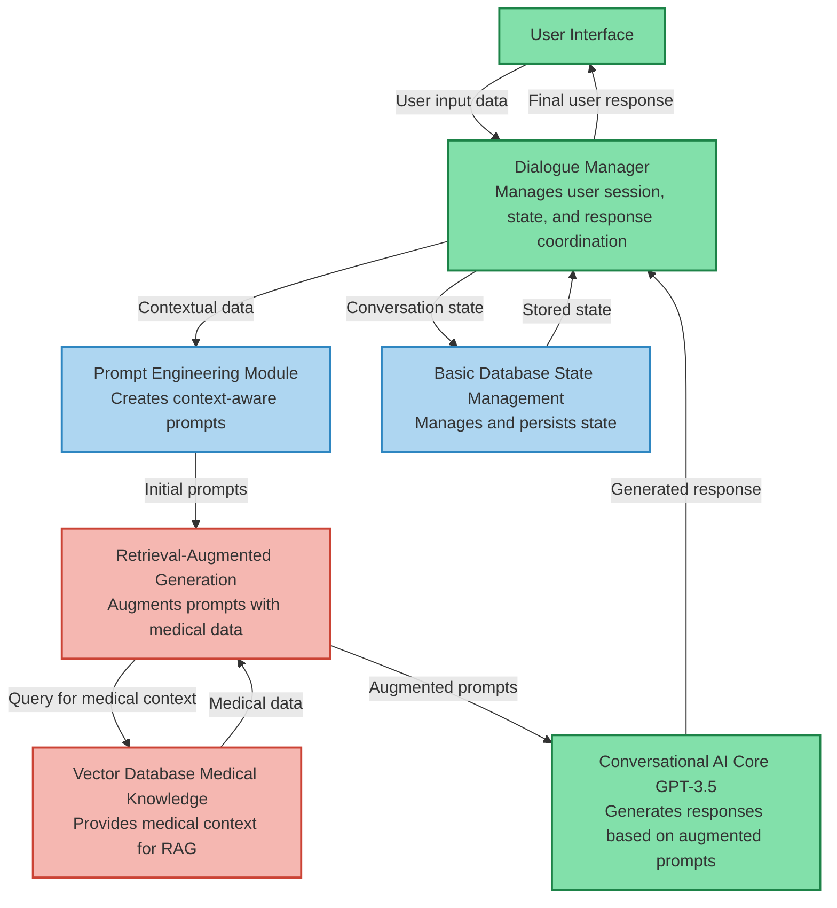
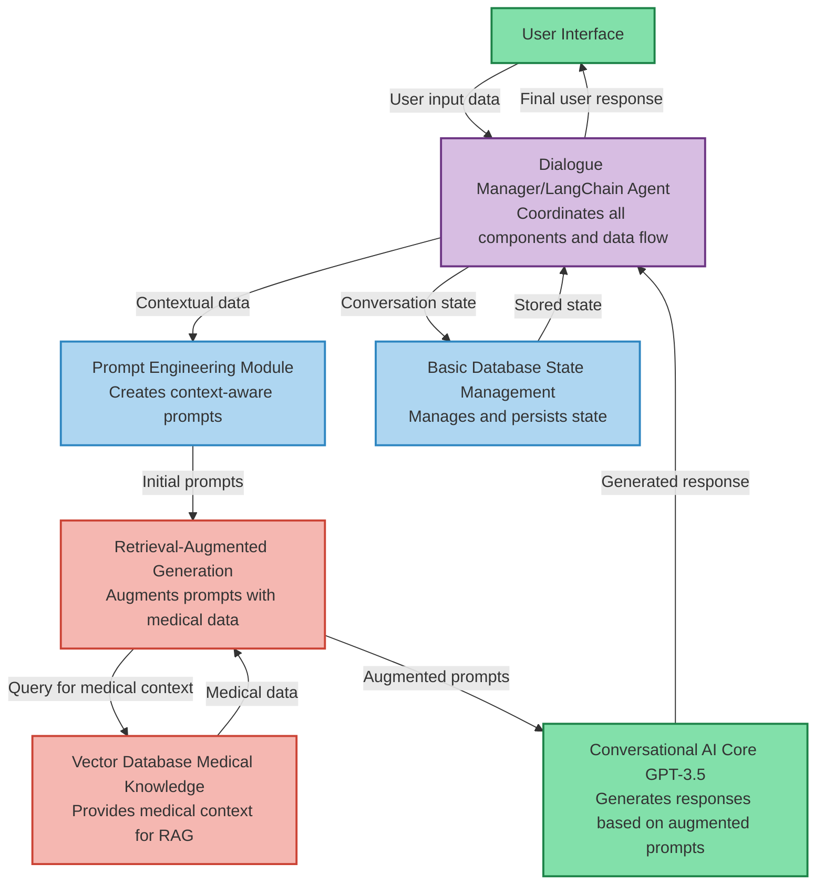
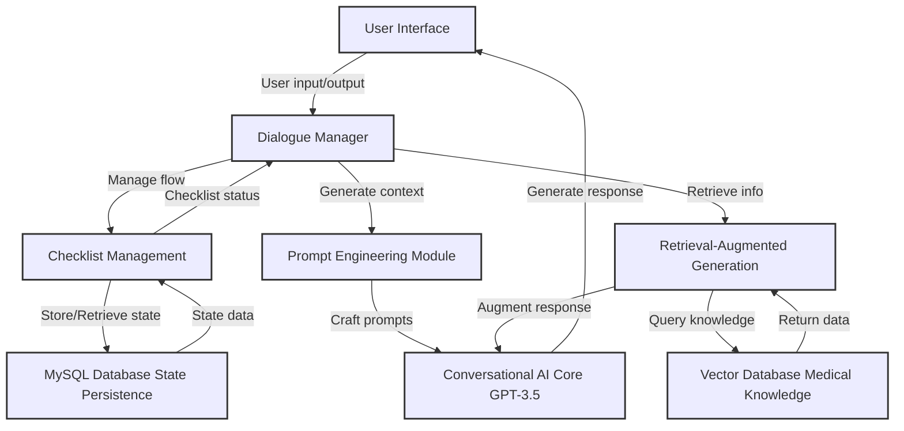
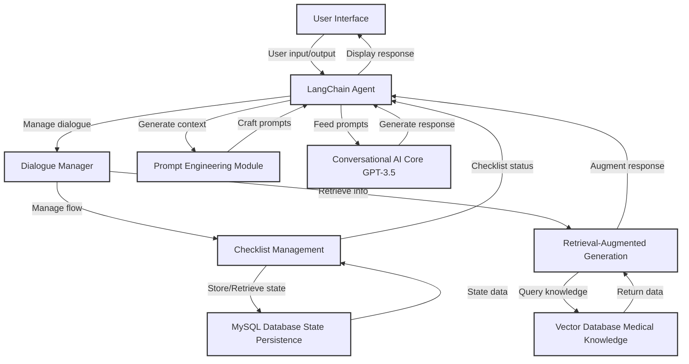
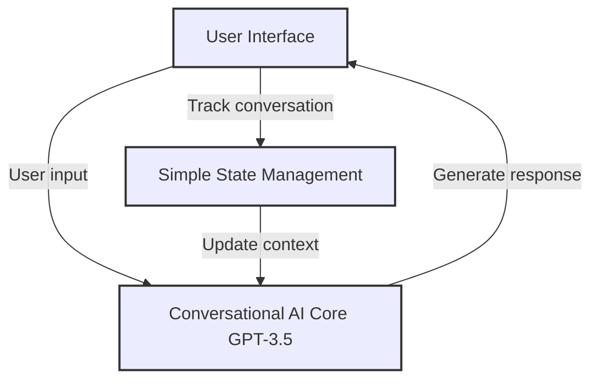

# Flow Diagrams of RECO Conversational AI System

## Milestone 1: Proof of Concept POC (green)

**Objective:** Demonstrate the basic functionality of a conversational AI in engaging with users and managing simple dialogue flows.

**Components:**

- User Interface (UI): The primary interface for patient interaction.
- Conversational AI Core GPT-3.5: Processes user input into natural language responses, demonstrating the core capabilities of AI in understanding and generating text.
- Dialogue Manager: Manages user sessions and response dispatch, ensuring that the flow of conversation follows logical progressions.

**Deliverables:**

- A basic conversational system that can handle a set series of dialogues.
- Documentation on system capabilities and limitations at this stage.

**Estimated Duration:** 2 weeks

**Resources Needed:**

- Access to OpenAI's GPT-3.5 API.
- Basic web development tools for the UI.

**Risks/Questions:**

- Will the basic dialogue management system be sufficient to handle unexpected user inputs?
- How will the system perform under different user scenarios?

## Milestone 2: Basic System Integration (blue)

**Objective:**
Enhance the system by introducing more sophisticated state management and prompt engineering to handle more complex dialogues and contexts.

**Components:**

- Prompt Engineering Module: Enhances the ability of the system to generate context-aware prompts that are more likely to elicit necessary information from users.
- Basic Database State Management: Manages and persists state information to maintain context across dialogue sessions.

**Deliverables:**

- An enhanced conversational system capable of managing state and using improved prompts.
- Integration of a basic database for state persistence.

**Estimated Duration:** 2 weeks

**Resources Needed:**

- Database management system (likely MySQL or MongoDB).
- Additional development in Python for prompt engineering.

**Risks/Questions:**

- How effectively can the newly integrated database handle state management across multiple user sessions?
- Are the crafted prompts sufficiently robust to guide conversations as intended?

## Milestone 3: Advanced Features Integration (red)

**Objective:**
Integrate advanced features like Retrieval-Augmented Generation to pull in relevant medical information, enhancing the accuracy and relevance of the dialogue.

**Components:**

- Retrieval-Augmented Generation: Augments prompts with medical data, improving the system's ability to provide medically relevant responses.
- Vector Database Medical Knowledge: Stores and provides access to medical knowledge that enhances the system's responses.

**Deliverables:**

- A system that integrates medical knowledge into conversations.
- Demonstrable examples of enhanced dialogues that utilize external medical information.

**Estimated Duration:** 2 weeks

**Resources Needed:**

- Setup and maintenance of a vector database (using Elasticsearch or similar technology).
- Integration with medical knowledge bases.

**Risks/Questions:**

- How will the system ensure the accuracy and relevance of the medical information retrieved?
- What mechanisms will be in place to update the medical knowledge as new information becomes available?

## Milestone 4: Full System Integration with LangChain Agent (purple)

**Objective:** Fully integrate the system using LangChain agents to manage the flow and interactions between all components, ensuring smooth data flow and effective conversation management.

**Components:**

- Dialogue Manager/LangChain Agent: Acts as the central coordinator for all components, managing data flow and system responses effectively.

**Deliverables:**

- A fully integrated conversational AI system capable of complex interactions and data management.
Comprehensive testing and optimization results.

**Estimated Duration:** ??

**Resources Needed:**

- Full access to LangChain libraries and necessary APIs.
- Advanced server or cloud resources to handle the increased processing requirements.

**Risks/Questions:**

- How will the integration with LangChain affect system performance and scalability?
- What challenges might arise in coordinating between multiple advanced components, and how can they be mitigated?

## Older charts, ignore

Dead simple version

